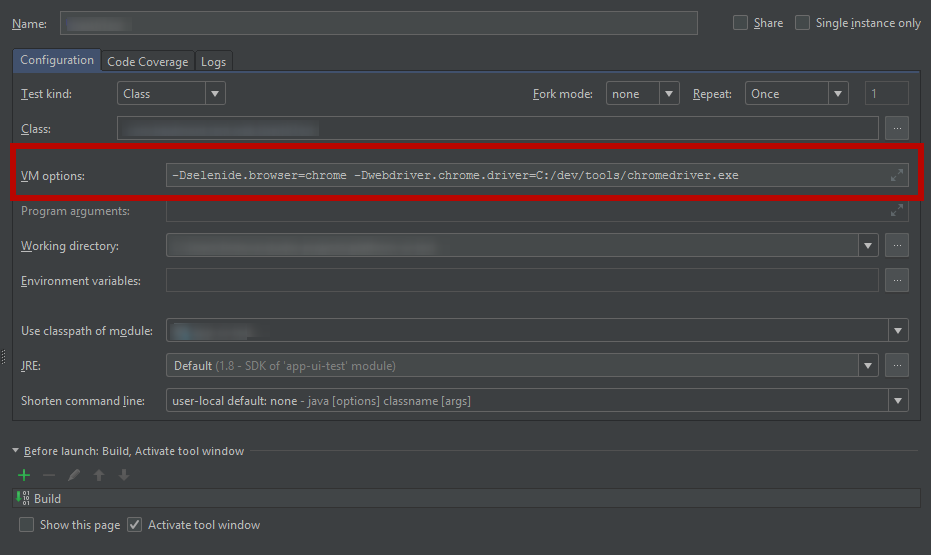

masquerade
==========

Cuba Platform UI testing library.

<a href="http://www.apache.org/licenses/LICENSE-2.0"></a>
<a href='https://bintray.com/cuba-platform/main/masquerade/2.0.1/link'></a>
<a href="https://travis-ci.org/cuba-platform/masquerade"></a>

## Overview

The library provides an ability to create UI tests for CUBA-based applications. 
It can help you to write better tests.

It is based on:

* Java
* Selenide
* Selenium

# Getting started
    
## Creating test project 
    
Create a simple Java project in IntelliJ IDEA. The project should have the 
following structure:

```
+ src
  + main 
    + java
  + test
    + java
      + com/company/demo
+ build.gradle
+ settings.gradle  
```

Here’s the complete `build.gradle` file:

```groovy
apply plugin: 'java'

group = 'com.company.demo'
version = '0.1'

sourceCompatibility = 1.8

repositories {
    mavenCentral()    
    maven {
        url "https://dl.bintray.com/cuba-platform/main"
    }    
}

dependencies {
    testCompile('junit:junit:4.12')
    
     //the library for the UI testing
    testCompile('com.haulmont.masquerade:masquerade-web:<check the latest version>')
    
    //the library provides an ability to access web-services, JMX and etc.
    testCompile('com.haulmont.masquerade:masquerade-connector:<check the latest version>')
    
    // enable logging
    testCompile('org.slf4j:slf4j-simple:1.7.25')
}
```

Find the latest version number here: https://bintray.com/cuba-platform/main/masquerade

## Creating a test

In the `src/test/java` folder create a new package in the `com.company.demo` and name it `composite`. Create 
a new Java class in this package and name it `LoginWindow`. This class 
should be inherited from the `Composite\<T>` where `T` is the name of your 
class. This class will be used as a helper class, usually it declares UI 
components of an application screen / frame / panel that is shown in a web page. 
Also, all test methods can be declared here.
 
All class attributes should be marked with the ```@Wire``` annotation. 
This annotation has optional `path` element which allows userService to define 
the path to the component using the `cuba-id` parameter. If the component does 
not have the `cuba-id` parameter, you can use the ```@FindBy``` annotation 
instead. This annotation has a list of optional parameters, like `name`, 
`className`, `id` and so on, which helps to identify the component.

The type of the attribute in the class corresponds to the type of the screen 
component. If the component has a type which is not defined in the library, use 
the `Untyped` type. 

The name of the attribute corresponds to the `cuba-id` attribute of a DOM 
element that corresponds to the UI component. 

```java
import com.haulmont.masquerade.Wire;
import com.haulmont.masquerade.base.Composite;
import com.haulmont.masquerade.components.Button;
import com.haulmont.masquerade.components.CheckBox;
import com.haulmont.masquerade.components.Label;
import com.haulmont.masquerade.components.LookupField;
import com.haulmont.masquerade.components.PasswordField;
import com.haulmont.masquerade.components.TextField;
import org.openqa.selenium.support.FindBy;

public class LoginWindow extends Composite<LoginWindow> {

    @Wire
    public TextField loginField;

    @Wire
    public PasswordField passwordField;

    @Wire(path = "rememberMeCheckBox")
    public CheckBox rememberMeCheckBox;

    @Wire(path = {"loginFormLayout", "loginButton"})
    public Button loginSubmitButton;

    @Wire
    public LookupField localesSelect;

    @Wire
    public Label welcomeLabel;

    @FindBy(className = "c-login-caption")
    public Label welcomeLabelTest;
}
``` 

Create a Java class in the `com.company.demo` package in the `src/test/java` folder. Name it `LoginWindowTest`. 

Create a new method and add ```@Test``` annotation to it. The ```@Test``` 
annotation tells JUnit that the public void method can be run as a test case. 
 
You can use all JUnit annotations to improve the tests. Also it is possible to 
use a set of assertion methods provided by JUnit.
 
```java
import com.company.demo.composite.LoginWindow;
import com.haulmont.masquerade.components.Untyped;
import org.junit.Test;

import static com.codeborne.selenide.Selenide.close;
import static com.codeborne.selenide.Selenide.open;
import static com.haulmont.masquerade.Components.$c;
import static com.haulmont.masquerade.Components.wire;
import static com.haulmont.masquerade.Conditions.*;

public class LoginWindowTest {

    @Test
    public void loginTest() {
        // open URL of an application
        open("http://localhost:8080/app");

        // obtain UI object
        LoginWindow loginWindow = $c(LoginWindow.class);

        loginWindow.loginField
                .shouldBe(EDITABLE)
                .shouldBe(ENABLED);

        // setting values
        loginWindow.loginField.setValue("admin");
        loginWindow.passwordField.setValue("admin");
        loginWindow.rememberMeCheckBox.setChecked(true);

        // fluent asserts
        loginWindow.welcomeLabel
                .shouldBe(VISIBLE);

        loginWindow.loginSubmitButton
                .shouldBe(VISIBLE)
                .shouldBe(ENABLED)
                .shouldHave(caption("Submit"));

        loginWindow.rememberMeCheckBox
                .shouldBe(VISIBLE)
                .shouldBe(CHECKED);

        // get values from Component
        String caption = loginWindow.loginSubmitButton.getCaption();
        boolean enabled = loginWindow.loginSubmitButton.is(ENABLED);

        Untyped loginFormLayout = wire(Untyped.class, "loginFormLayout");
        loginFormLayout.shouldBe(VISIBLE);

        loginWindow.loginSubmitButton.click();
        
        close();
    }
}
``` 

The `open()` method is a standard Selenide method. It opens a browser window 
with the given URL. The second line creates an instance of the masquerade 
Component and binds it to the UI component (LoginWindow) on the screen including 
all the annotated fields inside of the LoginWindow class. After that, you can 
access the screen components as class attributes. You can check the attributes 
visibility, get captions, set values, click the buttons and so on.

# Tips & Tricks

Here are some useful tips on how to work with the library.

## How to work with elements

The library has a special method  ```$c``` to define any element on the screen. 
This method has three implementations:

* The first implementation gets the element by its class:

    ```$c(Class<T> clazz)```
* The second implementation gets the element by its class and the path:

    ```$c(Class<T> clazz, String... path)```
* The third implementation gets the element by its class and _by_ selector:

    ```$c(Class<T> clazz, By by)```
    
For example, we can click the button on the screen: 

```java
import static com.haulmont.masquerade.Components.$c;

$c(Button, 'logoutButton').click();
```

## How to check the state of an element

Selenide allows you to check some conditions.

To check if the element is enabled, visible or checked, use the `shouldBe` 
element. For example:

```java
loginButton
   .shouldBe(VISIBLE)
   .shouldBe(ENABLED);
```

To check if the element has some properties, use the `shouldHave` element. For example:

```java
welcomeLabel.shouldHave(Conditions.value('Welcome to CUBA!'));
```    

## How to work with the Selenide elements
    
If the component does not have the `cuba-id` parameter, you can use the 
```@FindBy``` annotation. This annotation has a list of optional parameters, 
like `name`, `className`, `id` and so on, which helps to identify the component.

```java
@FindBy(className = "c-login-caption")
public Label welcomeLabelTest;
```    

Also, using this annotation, you can define `SelenideElement` type for the attribute 
instead of the types provides by masquerade. After that, you can use all test 
methods provided by Selenide. The name of the attribute can be any.

```java
import com.codeborne.selenide.SelenideElement;

@FindBy(className = "c-login-caption")
public SelenideElement welcomeLabelTest;
```   

Another way to define the `SelenideElement` type attribute is using the 
```@Wire``` annotation. You can write the `SelenideElement` type instead of 
masquerade types, but the name of the attribute should correspond to the 
`cuba-id` attribute of a DOM element that corresponds to the UI component.

```java
@Wire
public SelenideElement loginField;
```    

The third way to work with the Selenide elements is to use ```getDelegate()``` 
method. This method returns the `SelenideElement` type component. After that, you 
can use all test methods provided by Selenide.

```java
loginWindow.getDelegate().exists();
```    

## Useful tips for the Groovy tests

You can use any JVM language with the library including Groovy / Scala / Kotlin. 
There are some useful tips for those who use Groovy to write the tests. 

* .with() method.

Groovy closures have a delegate associated with them. The delegate can respond 
to method calls which happen inside of the closure. It enables you to use 
methods/properties within a `with {}` closure without having to repeat the 
object name each time.

```groovy
loginWindow.with {
    loginField.value = 'testUser'
    passwordField.value = '1'
    rememberMeCheckBox.checked = true

    commit()
}
```
* Ability to set the value of the element using "property access" syntax

In Groovy, getters and setters form what we call a "property", and offer a 
shortcut notation for accessing and setting such properties. So instead of the 
Java-way of calling getters / setters, you can use a field-like access notation: 

```groovy
loginField.value = 'testUser'
```

* def

```def``` means that the actual type of the value will be automatically inferred 
by the compiler. It eliminates the unnecessary boilerplate in variable 
declarations and makes your code shorter.

```groovy
def loginWindow = $c(LoginWindow)
```

## Run tests

Please note that you need to download one of the latest versions of the web driver depending on the browser you want to use to testing.
For Chrome browser this is [chromedriver](http://chromedriver.chromium.org/downloads), for Firefox this is [geckodriver](https://github.com/mozilla/geckodriver/releases).

To run the test, first of all, you need to set ```cuba.testMode``` property to 
true in the `web-app.properties` file in the `web` module in your CUBA application. After that you 
should start the application using Studio or Gradle tasks. To start application 
with Gradle, run the following tasks in the terminal:

    gradle setupTomcat deploy createDb start

If you run your tests in Chrome browser, you need to edit standard
test configuration for the test project in IntelliJ. To do so, click the 
*Select Run/Debug Configuration* button and select *Edit Configurations*  in the 
drop-down list. In the VM options field, add the following:

    -Dselenide.browser=chrome -Dwebdriver.chrome.driver=<your_path>/chromedriver.exe

where `<your_path>` is the path to the chrome driver on your computer.



After that select the simple test or the test class you want to run, right 
click on it and select *Debug* option.

To run the tests using Gradle, add the following task to the ```build.gradle``` file:

```groovy
test {
     systemProperty 'selenide.browser', System.getProperty('selenide.browser')
     systemProperty 'webdriver.chrome.driver', System.getProperty('webdriver.chrome.driver')
}
```

After that, run the following task in the terminal:

    gradle test -Dselenide.browser=chrome -Dwebdriver.chrome.driver=<your_path>/chromedriver.exe
    
where `<your_path>` is the path to the chrome driver on your computer.
